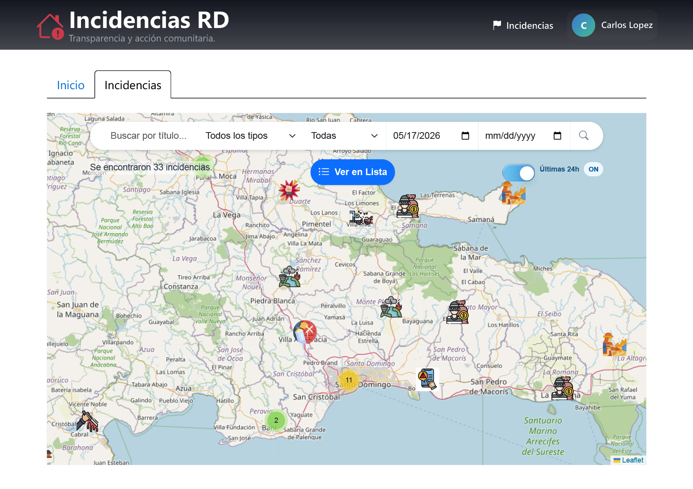
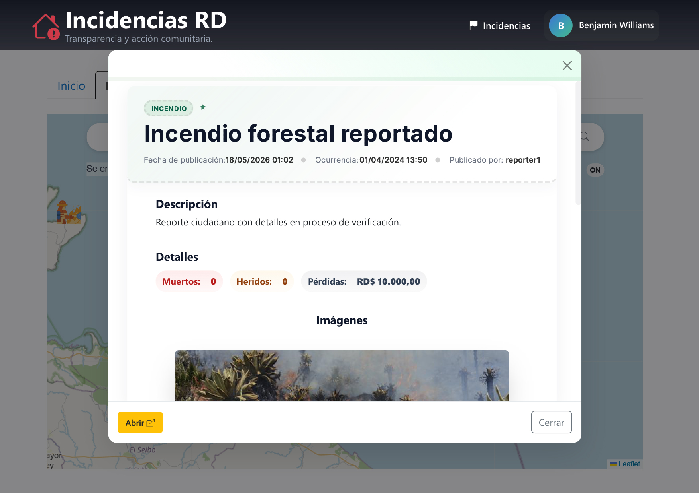
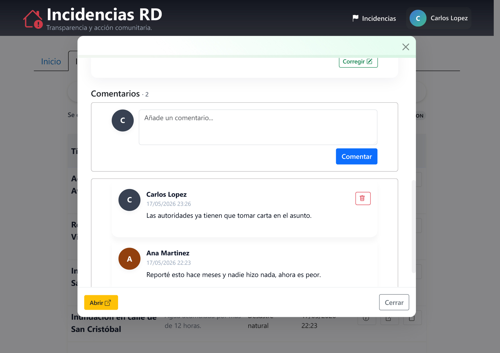
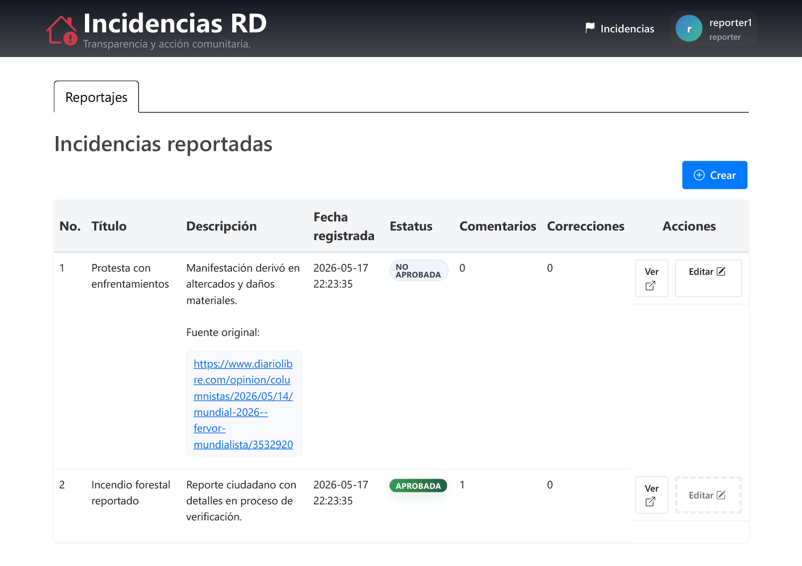
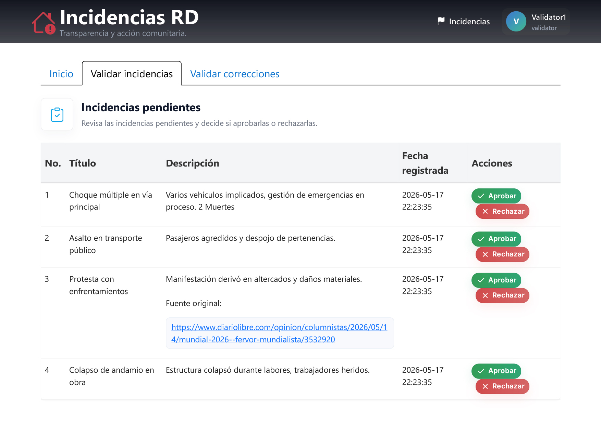
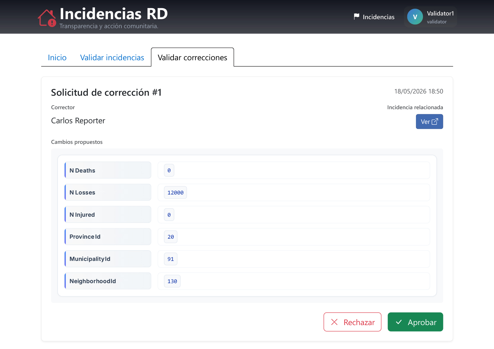
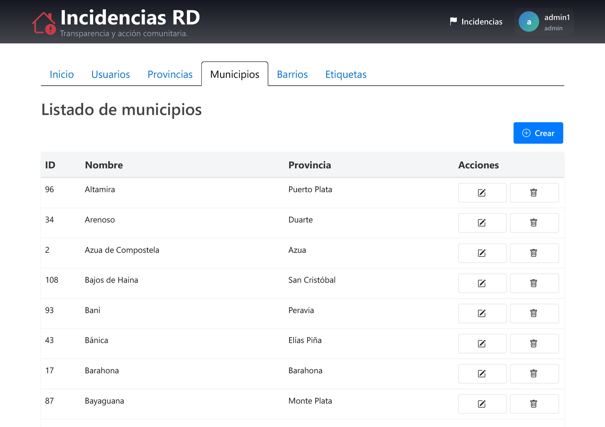
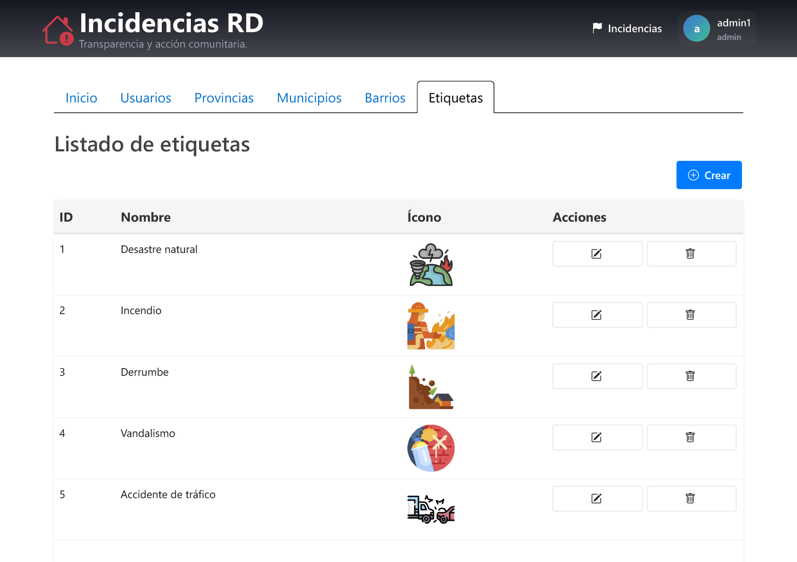

# IncidentsDR

IncidentsDR is a PHP web application that lets users report, manage, and visualize real-world incidents in the Dominican Republic on an interactive map.



---

## Table of Contents

- [Features](#features)
- [Installation](#installation)
  - [Requirements](#requirements)
  - [Install Dependencies](#install-dependencies)
  - [`.env` Configuration](#env-configuration)
  - [Database Setup](#database-setup)
- [Run Locally](#run-locally)
- [Roles \& Permissions](#roles--permissions)
- [Test Accounts](#test-accounts)
- [Contributing](#contributing)
- [Authors](#authors)
- [License](#license)

---

## Features

- User registration and authentication via Google and Microsoft OAuth.
- Interactive map and list views showing incidents with labeled icons.
- Search and filter controls.
- Click-to-open incident modal with full details, comments, and correction suggestions.
- Role-based dashboards for reporters, validators, and administrators.
- Administrative topology modeling (province, municipality, neighborhood).



---

## Installation

### Requirements

| Tool                                                     | Version   |
| -------------------------------------------------------- | --------- |
| [PHP](https://www.php.net/downloads.php)                 | >= 8.4    |
| [Composer](https://getcomposer.org/download/)            | >= 2.8.9  |
| [MySQL](https://downloads.mysql.com/archives/community/) | >= 8.0.42 |

---

### Install Dependencies

From the `src/` folder:

```bash
cd src
composer install
```

---

### `.env` Configuration

Create a `.env` file at `src/config/.env` and fill in the required values:

```env
# Database
HOST=
USER=
PASS=

# Mail Service
MAIL_USER=
MAIL_PASS=

# Google OAuth (optional)
GOOGLE_CLIENT_ID=
GOOGLE_CLIENT_SECRET=

# Microsoft OAuth (optional)
MICROSOFT_CLIENT_ID=
MICROSOFT_CLIENT_SECRET=
```

#### Mail Service Setup

`MAIL_USER` must be a Gmail address. `MAIL_PASS` is not your Gmail password; it is an **App Password** generated specifically for this application.

1. Go to [myaccount.google.com/security](https://myaccount.google.com/security) and enable **2-Step Verification** if you haven't already. App Passwords require this to be active.
2. Go to [myaccount.google.com/apppasswords](https://myaccount.google.com/apppasswords), create a new **App Password**, and copy the generated value into `MAIL_PASS`.

---

#### Google OAuth Setup (Optional)

##### Step 1. Create a Google Cloud project

1. Go to [console.cloud.google.com](https://console.cloud.google.com/).
2. Click the project dropdown at the top and select **New project**.
3. Give it a name and click **Create**.

##### Step 2. Configure the OAuth consent screen

1. Go to **APIs & Services** > **OAuth consent screen**.
2. Select **External** as the user type and click **Create**.
3. Fill in the required fields:
   - **App name**: IncidentsDR
   - **User support email**: the value of `MAIL_USER`
   - **Developer contact email**: the value of `MAIL_USER`
4. Click **Save and continue** through the remaining steps.

##### Step 3. Create OAuth credentials

1. Go to **APIs & Services** > **Credentials**.
2. Click **Create credentials** > **OAuth client ID**.
3. Set the **Application type** to **Web application**.
4. Under **Authorized redirect URIs**, click **Add URI** and enter:

   ```plain
   http://localhost:1111/auth/GoogleController.php
   ```

5. Click **Create**.

**Step 4. Copy credentials to `.env`**

A dialog will show your credentials. Copy them into your `.env`. You can also retrieve them at any time from the **Credentials** page by clicking on your OAuth client.

---

#### Microsoft OAuth Setup (Optional)

1. Register an app in [Azure Portal](https://portal.azure.com/) under **Microsoft Entra ID** > **App registrations**.
2. Add the following authorized redirect URI:

   ```md
   http://localhost:1111/auth/MicrosoftCallbackController.php
   ```

3. Copy the **Application (client) ID**, create a client secret under **Certificates & secrets**, and paste both into `.env`.

---

### Database Setup

From the **repo root**:

```bash
php src/db/install.php
```

This creates the required tables and inserts sample data so you can start using the app immediately.

---

## Run Locally

**Option A. Start the built-in PHP server manually:**

From the **repo root**:

```bash
php -S localhost:1111 -t src/public
```

Access at `http://localhost:1111`. Use `Ctrl+C` to stop.

---

**Option B. Use a VS Code extension (recommended):**

1. Install the **PHP Server** extension (`brapifra.phpserver`), listed in [.vscode/extensions.json](.vscode/extensions.json).
2. Open the Command Palette (`Ctrl+Shift+P`) and run **PHP Server: Reload project**.

Use **PHP Server: Stop project** to stop.

---

## Roles & Permissions

Four roles exist in the system:

### `default` <!-- omit in toc -->

- Access the map and list pages.
- Open incident detail modals.
- Comment on incidents and suggest corrections.



### `reporter` <!-- omit in toc -->

- All `default` permissions.
- Reporter dashboard after login.
- Create incidents and edit or delete their own unapproved incidents.
- View a list of their reported incidents.



### `validator` <!-- omit in toc -->

- All `default` permissions.
- Validator dashboard after login.
- Review and approve or reject unapproved incidents and corrections.

| Feature                       | View                                                                 |
| ----------------------------- | -------------------------------------------------------------------- |
| Validate incidents            |      |
| Validate incident corrections |  |

### `admin` <!-- omit in toc -->

Full access to the system:

- Admin dashboard after login.
- Assign roles, manage labels, provinces, municipalities, and neighborhoods.
- Manage all incidents, user accounts, and comments.

| Feature             | View                                                               |
| ------------------- | ------------------------------------------------------------------ |
| Municipalities CRUD |  |
| Labels CRUD         |                  |

---

## Test Accounts

Four sample accounts are included for testing. Password for all: `app12345`

| Email                                                 | Role        |
| ----------------------------------------------------- | ----------- |
| [carloslopez@email.com](mailto:carloslopez@email.com) | `default`   |
| [reporter1@gmail.com](mailto:reporter1@gmail.com)     | `reporter`  |
| [validator1@gmail.com](mailto:validator1@gmail.com)   | `validator` |
| [admin1@gmail.com](mailto:admin1@gmail.com)           | `admin`     |

---

## Contributing

Contributions are welcome. Suggested workflow:

1. Fork the repository.
2. Create a feature branch: `feat/my-change`.
3. Make your changes following the existing code style.
4. Include appropriate documentation or tests.
5. Commit, push, and open a pull request describing the change and the reason for it.

---

## Authors

| Name                         | Contact                                              |
| ---------------------------- | ---------------------------------------------------- |
| Roniel Antonio Sabala Germán | [ronielsabala@gmail.com](ronielsabala@gmail.com)     |
| Jeremy Reyes González        | [jeremyrg32@gmail.com](jeremyrg32@gmail.com)         |
| Abel Eduardo Martínez Robles | [abelrobles0409@gmail.com](abelrobles0409@gmail.com) |

---

## License

This project is available under the **MIT License**.
